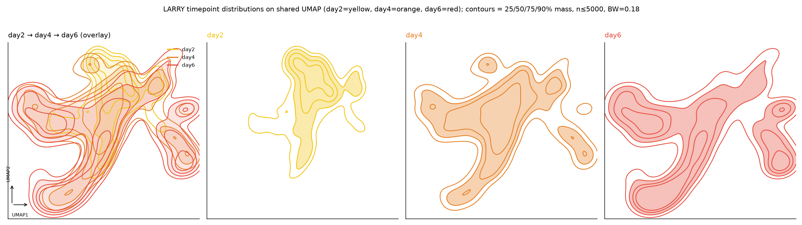
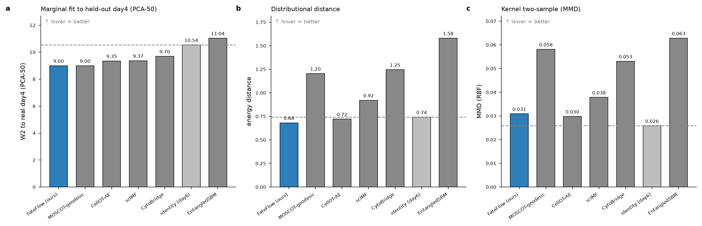
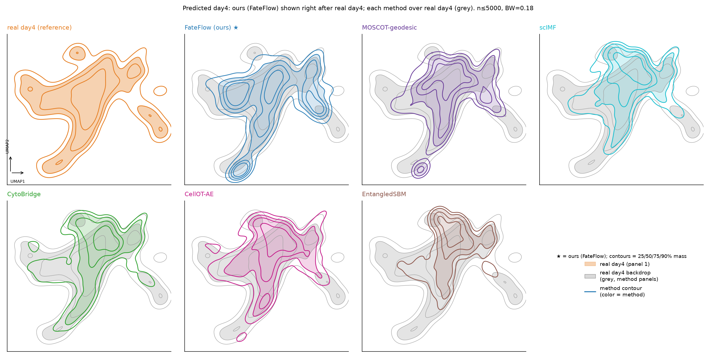

# Cell_dynamics_flow

Metric Flow Matching (MFM, [Kapusniak et al. 2024, arXiv:2405.14780](https://arxiv.org/abs/2405.14780))
vs straight-line Flow Matching (CondOT) on the LARRY state-fate hematopoiesis data
(day2 → day6, **day4 held out** as the intermediate marginal to recover).


The package mirrors the module layout of the official reference implementation
[kkapusniak/metric-flow-matching](https://github.com/kkapusniak/metric-flow-matching).
Algorithm code (EMA, the `MetricFlowMatcher` conditional path/flow, the LAND and
RBF data-manifold metrics, the OT coupling) follows the official files closely;
the pytorch_lightning + wandb orchestration is replaced with plain-torch training
loops so the code runs unattended on a batch scheduler without those heavy deps.

## Layout
```
mfm/
  flow_matchers/
    ema.py                 EMA of model params
    models/mfm.py          MetricFlowMatcher: geodesic/straight conditional path + target velocity
    models/mixflow.py      Mixture-Flow: fate-channel-conditioned generative flow (straight path)
    models/mixgeoflow.py   Mixture-Geodesic-Flow: fate-channel flow with a density-metric geodesic
    geopath_net_train.py   ALGO 1: train geodesic interpolant (min metric geodesic energy)
    flow_net_train.py      ALGO 2: (metric) flow matching + NeuralODE prediction
  geo_metrics/
    land.py                LAND diagonal metric (closed form)
    rbf.py                 RBF density network metric (KMeans centers, h->1 on data)
    metric_factory.py      DataManifoldMetric: picks land/rbf, metric-weighted velocity
    density.py             scalar conformal KDE metric g(x)=1/(rho_hat+rho0) (Mixture-Geodesic-Flow)
  networks/
    flow_networks/         VelocityNet + FateCondVelocity (fate-mode-embedded velocity)
    geopath_networks/      GeoPathMLP + InterpolantCorrection (endpoint-fixed geodesic)
    ...                    SimpleDenseNet backbone
  dataloaders/
    trajectory_data.py     LARRY npz loader, per-timestep frames, OT sampler (POT)
    channels.py            fate-channel build (day6-GMM + mode-OT Sinkhorn) + mode-block sampler
  train/
    parsers.py             CLI args (defaults from official single_cell/50dims configs)
    main.py                two-stage train of MFM + straight-FM; predict day4/day6
    main_mixflow.py        train Mixture-Flow; predict day4/day6
    main_mixgeoflow.py     train Mixture-Geodesic-Flow; predict day4/day6
prepare_data.py            build larry_pca_mfm.npz from day{2,4,6}.npz (X_pca)
run_umap.py                shared-UMAP embedding of all methods' day4 predictions
```

## Run
```bash
python prepare_data.py --src_dir <dir with day2/4/6.npz> --out larry_pca_mfm.npz
python -m mfm.train.main            --data larry_pca_mfm.npz --out mfm_predictions.npz
python -m mfm.train.main_mixflow    --data larry_pca_mfm.npz --out mixflow_predictions.npz
python -m mfm.train.main_mixgeoflow --data larry_pca_mfm.npz --out mixgeoflow_predictions.npz
```
`mfm_predictions.npz` holds `fm_pred_day4/day6` and `mfm_pred_day4/day6` in the
original 50-d PCA coordinates, ready for W2/energy/MMD scoring against real day4.

## FateFlow (fate-channel mixture flow)
Motivated by the empirical finding that held-out day4 is largely a *reweighting* of
fixed modes on the shared day2∪day6 support. Both models factorize transport into `K`
fate **channels**: a `K`-mode GMM on day6, a mode-level entropic-OT plan coupling day2
→ day6 mode mass, and a velocity **conditioned on the target fate mode**. This keeps the
reweighting structure yet stays generative (produces novel on-arm coordinates) and
avoids the inter-arm barycentric smear of an unconditioned mixture-weighted flow.

- **FateFlow** (`models/mixflow.py`) uses a straight per-channel chord. On LARRY it
  is the only generative model here to recover real branch commitment.
- **FateFlow-Geo** (`models/mixgeoflow.py`) replaces the chord with a
  density-metric geodesic. **Recorded negative result:** the geodesic *raised* path
  energy and slightly reduced commitment — the density metric treats the dense
  undifferentiated blob as cheap and pulls paths toward it, opposing the channel
  conditioning. Retained for reproducibility and ablation, not as the recommended run.

## Results




